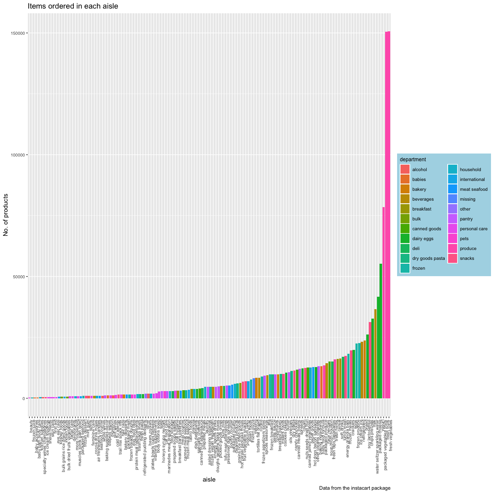
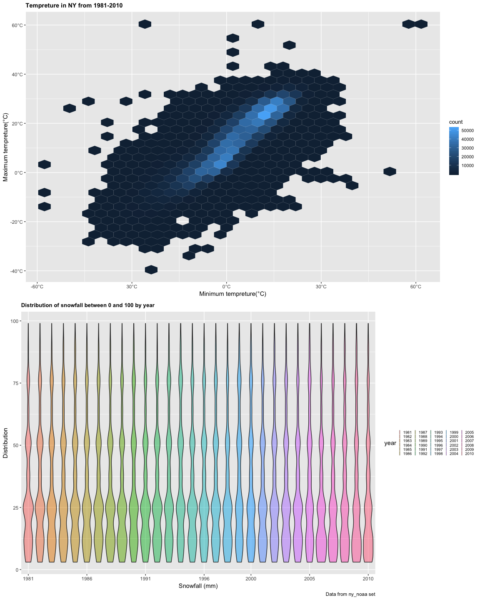

p8105\_hw3\_sj2921
================
Shan Jiang
10/5/2018

## Problem 1

``` r
# Set the graph properties(theme, color and size) for ggplot
library(ggplot2)
library(readxl)
```

  - Import the
    data

<!-- end list -->

    ## ── Attaching packages ────────────────────────────── tidyverse 1.2.1 ──

    ## ✔ tibble  1.4.2     ✔ purrr   0.2.5
    ## ✔ tidyr   0.8.1     ✔ dplyr   0.7.6
    ## ✔ readr   1.1.1     ✔ stringr 1.3.1
    ## ✔ tibble  1.4.2     ✔ forcats 0.3.0

    ## ── Conflicts ───────────────────────────────── tidyverse_conflicts() ──
    ## ✖ dplyr::filter() masks stats::filter()
    ## ✖ dplyr::lag()    masks stats::lag()

  - structure data: Response indicating the proportion of subjects with
    each
response

<!-- end list -->

``` r
# Convert response to build a factor; Specify the levels of response_vector
response <- 
  factor(brfss_df$response,
  levels <- (c("Excellent","Very Good", "Good", "Fair", "Poor")))
```

### Questions

  - 1.In 2002, CT, FL, NC were observed at 7 locations.

<!-- end list -->

``` r
 brfss_df %>% 
  filter(year == "2002") %>% 
  group_by(state) %>% 
  distinct(location) %>% 
  summarise(n = n()) %>% 
  filter(n == 7)
```

    ## # A tibble: 3 x 2
    ##   state     n
    ##   <chr> <int>
    ## 1 CT        7
    ## 2 FL        7
    ## 3 NC        7

  - 2.Make a spaghetti plot showing the number of observations in each
    state from 2002 to 2010

<!-- end list -->

``` r
location <- brfss_df %>% 
  group_by(state, year) %>% 
  summarise(n = n()) 

ggplot(location, aes(x = year, y = n, color = state)) +
  geom_line(alpha = .3, aes(group = state)) +
  geom_point(alpha = .3) +
  labs(
    title = "Number of observations in each state(n) from 2002 to 2010",
    x = "Year",
    y = "Number of observations in each state(n)",
    caption = "Data from the BRFSS package"
  )  + 
  viridis::scale_color_viridis(
    name = "State",
    discrete = T
  ) +
  theme(plot.title = element_text(size = 9, face = "bold"))
```

<!-- -->

  - The spaghetti plot shows there are no more than 10 observed location
    during 2002 - 2010 for a lot of states.

  - Florida has experienced a sharp increase over the years before 2007
    there are few locations, so it is hard to do a time series in that
    case.

  - 3.  Make a table showing, for the years 2002, 2006, and 2010, the
        mean and standard deviation of the proportion of “Excellent”
        responses across locations in NY State.

<!-- end list -->

``` r
brfss_df %>% 
  filter(state == "NY" & response == "Excellent") %>%
  filter(year == "2002" | year == "2006" | year == "2010") %>% 
  group_by(state, year) %>% 
  summarise(mean_ex = (mean(data_value, na.rm = T)),
            sd_ex = sd(data_value, na.rm = T)) %>% 
knitr::kable(digits = 2)
```

| state | year | mean\_ex | sd\_ex |
| :---- | ---: | -------: | -----: |
| NY    | 2002 |    24.04 |   4.49 |
| NY    | 2006 |    22.53 |   4.00 |
| NY    | 2010 |    22.70 |   3.57 |

### Comments:

  - From the graph above, we can see some outliers in the time-trend
    graph, as the Florida has two outliers in two years, so it shows a
    big variability across years.

  - 4.1 For each year and state, compute the average proportion in each
    response category (taking the average across locations in a state).

<!-- end list -->

``` r
panel <- brfss_df %>%
  group_by(state, year, response) %>% 
  summarise(n = n(),
            avg_pro = mean(data_value, na.rm = T)) 
```

  - 4.2 Make a five-panel plot that shows, for each response category
    separately, the distribution of these state-level averages over
    time.

<!-- end list -->

``` r
ggplot(panel, aes(x = year, y = avg_pro, color = state)) + geom_line(alpha = 0.4) +
  labs(
    x = "Year",
    Y = "state-level averages",
    title = "Distribution of state-level response averages over time",
    caption = "Data from the BRFSS package"
  ) +
  facet_grid(~response) +
  viridis::scale_color_viridis(
    name = "state", 
    discrete = TRUE,
    option = "inferno"
  ) +
  theme(axis.text = element_text(size = 4))
```

<!-- -->

#### Comments:

(1). The five panel plot shows that overall health condition among
states through the years from 2002 to 2010.

(2). The response of ‘good’ and ‘very good’ has a high percentage for
all states around the country, implying that the health status for the
general public of all states tend to concerntrates on the good or above
as fair and poor are at a rather low percentage of the whole dataset.

(3). The between group difference among the State-level groups are not
significant as the line shown in the graph tends to overlap with each
other.

(4). For the time series data analysis, the trend of health status for
state-level groups are stable as there is no evident flutuations over
the years for these 5 panels.

# problem 2

##### The dataset cleaning and summarizing

**Instacart Dataset description**

There are **1384617 observations** and **15** variables in the dataset.
The dataset is a long dataset using the `order_id` and `user_id` as keys
to identify distinct entries.

  - Key variables in the dataset

<!-- end list -->

1.  Both `aisle_id` and `aisle` are variable for identifying the
    location of products, which denotes the aisle for different products
    placement.

<!-- end list -->

``` r
# 21 departments: summary
depart <- instacart %>%  
  janitor::clean_names() %>% 
  distinct(department)  
```

2\.`department_id` is a integer variable, for implying the department
the products belong to, there are 21 distinct departments in total.

``` r
# ranking the topr 3 and the laat departments: summary
instacart %>%  
  janitor::clean_names() %>% 
  group_by(department) %>% 
  summarize(n = n()) %>% 
  mutate(dep_ranking = min_rank(desc(n))) %>% 
  filter(dep_ranking > 20 | dep_ranking < 4)
```

    ## # A tibble: 4 x 3
    ##   department      n dep_ranking
    ##   <chr>       <int>       <int>
    ## 1 bulk         1359          21
    ## 2 dairy eggs 217051           2
    ## 3 produce    409087           1
    ## 4 snacks     118862           3

  - **Department Popularity Ranking**: According to the ranking for
    no.of orders in each department, the 3 top-ranked department are
    **produce, dairy eggs and snacks**. The produce department has
    received 409087 orders which are the double of the second-ranked
    dairy eggs. The least popular department is **bulk**, which only
    received 1359 orders.

<!-- end list -->

``` r
user_unique <- instacart %>% 
  distinct(user_id) 
```

3.  `user_id` is used for marking each customers in the dataset, there
    are 1.353641610^{10} customers signed up in the symstem.

4.  `order_id`, `reordered` and `add_to_cart_order` are used as integer
    to attach info for orders from users.There is a mean of 8.7580443
    add to cart order in the dataframe.

5.  The one who has the highest purchasing power among users are the two
    **user\_id:149753, user\_id:197541**.Both of them have 80 orders and
    they have maintained a high reorder rate.

<!-- end list -->

  - The top-3 buyers for placing the most orders are presented as:

<!-- end list -->

``` r
# The top-3 buyers for placing the most orders
instacart %>% 
  janitor::clean_names() %>% 
  group_by(user_id) %>% 
  summarize(n = n()) %>% 
  mutate(user_ranking = min_rank(desc(n))) %>% 
  filter(user_ranking < 3)
```

    ## # A tibble: 2 x 3
    ##   user_id     n user_ranking
    ##     <int> <int>        <int>
    ## 1  149753    80            1
    ## 2  197541    80            1

6.  Products are marked by the variable of and `product_id`

<!-- end list -->

``` r
# The most popular products
instacart %>% 
  janitor::clean_names() %>% 
  group_by(product_name) %>% 
  summarize(n = n()) %>% 
  mutate(pro_ranking = min_rank(desc(n))) %>% 
  filter(pro_ranking < 3)
```

    ## # A tibble: 2 x 3
    ##   product_name               n pro_ranking
    ##   <chr>                  <int>       <int>
    ## 1 Bag of Organic Bananas 15480           2
    ## 2 Banana                 18726           1

  - The most popular product are **Bananas** which appeared in 18726
    orders. Bag of Organic Bananas, following as the second, they
    appeared in 15480 orders, so the supply of bananas should be
    addressed.

<!-- end list -->

7.  `order_dow` means the day in the week when the order was
    established.

## \#\#\#\# Questions

1.  How many aisles are there, and which aisles are the most items
    ordered from?

<!-- end list -->

``` r
aisle <- instacart %>% 
  distinct(aisle_id) 
## Rank and find the aisle most items ordered from
instacart %>% 
  group_by(aisle) %>% 
  summarize(n = n()) %>% 
  mutate(aisle_ranking = min_rank(desc(n))) %>% 
  filter(aisle_ranking < 2) 
```

    ## # A tibble: 1 x 3
    ##   aisle                 n aisle_ranking
    ##   <chr>             <int>         <int>
    ## 1 fresh vegetables 150609             1

``` r
## Find out the aisle_id corresponding to the fresh vegetables;
instacart %>% 
  group_by(aisle_id) %>% 
  summarize(n = n()) %>% 
  mutate(aisle_ranking = min_rank(desc(n))) %>% 
  filter(aisle_ranking < 2) 
```

    ## # A tibble: 1 x 3
    ##   aisle_id      n aisle_ranking
    ##      <int>  <int>         <int>
    ## 1       83 150609             1

  - There are in total **9045** aisles in the dataset.
  - **Aisle fresh vegetables** is the aisle most items ordered from, the
    id is 83.

<!-- end list -->

2.  Make a plot that shows the number of items ordered in each aisle.
    Order aisles sensibly, and organize your plot so others can read it.

<!-- end list -->

``` r
# Show the top 5 aisle "Best seller"
instacart %>%
  group_by(aisle) %>% 
  summarize(n = n()) %>% 
  arrange(desc(n)) %>% 
  top_n(5) 
```

    ## Selecting by n

    ## # A tibble: 5 x 2
    ##   aisle                           n
    ##   <chr>                       <int>
    ## 1 fresh vegetables           150609
    ## 2 fresh fruits               150473
    ## 3 packaged vegetables fruits  78493
    ## 4 yogurt                      55240
    ## 5 packaged cheese             41699

The above shows the top 5 aisle in the dataset.

  - set the graph size enable others to see clearly

<!-- end list -->

``` r
# Order the aisle sensibly including their department category
 instacart %>%
    group_by(aisle, department) %>% 
    summarize(n = n()) %>%
    arrange(desc(n)) %>% 
# seperate the aisle into several levels for graphing
    rename(no_items = n) %>% 
    mutate(as.character(no_items)) %>% 
    ggplot(aes(x = reorder(aisle, no_items), y = no_items, fill = department)) + # plot the aisle point graph 
    geom_col() +
    theme(axis.text.x = element_text(angle = 90, hjust = 1),
        axis.text = element_text(size = 7.5) ) +
  labs(
    title = "Items ordered in each aisle",
    x = "aisle",
    y = "No. of products",
    caption = "Data from the instacart package"
  ) + 
  theme(
    legend.title = element_text(size = 9), 
    legend.text = element_text(size = 8),
    legend.background = element_rect(fill = "lightblue", 
                                  size = 0.4, linetype = "solid"),
    legend.position = "right")
```

<!-- --> 2.
From the graph above, the point represents the number of products in
each aisle and the color represents the department in which every
product falls in. As there are so many rows/entries, I need to use point
instead of bar/col to show the results as it is more clear.

3.  most popular item in each of the aisles “baking ingredients”, “dog
    food care”, and “packaged vegetables fruits”.

<!-- end list -->

``` r
library(knitr)
# Filter the products in aisles “baking ingredients”
rank_3 <- instacart %>% 
  filter(aisle == "baking ingredients" | aisle == "dog food care" | aisle == "packaged vegetables fruits") %>% 
  group_by(aisle, product_name) %>% 
  summarise(n = n()) %>% 
  mutate(product_ranking = min_rank(desc(n))) %>% 
  filter(product_ranking < 2) 

# Print the table with knitr
knitr::kable(rank_3, caption = "most popular item in each of the aisles")
```

| aisle                      | product\_name                                 |    n | product\_ranking |
| :------------------------- | :-------------------------------------------- | ---: | ---------------: |
| baking ingredients         | Light Brown Sugar                             |  499 |                1 |
| dog food care              | Snack Sticks Chicken & Rice Recipe Dog Treats |   30 |                1 |
| packaged vegetables fruits | Organic Baby Spinach                          | 9784 |                1 |

most popular item in each of the aisles

**Summary** 3. This is a 3*2 table and there are three variables –
“aisle” and “product name” and “No. of each product”. * From the
table, we can know that: \* On “baking ingredients” aisle, “Light Brown
Sugar” is the most popular; \* On “dog food care” aisle, “Snacks sticks
Chicken & Rice Recipe Dog Treats” are the most popular ones; \*
On“packages vegetables fruits” aisle, “Organic Baby Spinach” is the
most popular.

4.  Make a table showing the mean hour of the day at which Pink Lady
    Apples and Coffee Ice Cream are ordered on each day of the week;
    format this table for human readers (i.e. produce a 2 x 7 table).

<!-- end list -->

``` r
# mean hour of the day 
instacart %>% 
  filter(product_name %in% c("Pink Lady Apples", "Coffee Ice Cream")) %>% 
  group_by(product_name, order_dow) %>% 
  summarize(mean_time = round(mean(order_hour_of_day), digits = 2) ) %>% 
  spread(key = "order_dow", value = "mean_time") %>% 
  knitr::kable(caption = "mean hour of the day 2 items are ordered ", digits = 2)
```

| product\_name    |     0 |     1 |     2 |     3 |     4 |     5 |     6 |
| :--------------- | ----: | ----: | ----: | ----: | ----: | ----: | ----: |
| Coffee Ice Cream | 13.77 | 14.32 | 15.38 | 15.32 | 15.22 | 12.26 | 13.83 |
| Pink Lady Apples | 13.44 | 11.36 | 11.70 | 14.25 | 11.55 | 12.78 | 11.94 |

mean hour of the day 2 items are ordered

#### Table summary

The result is a 2x7 table. There are 7 variables as column names ranging
from 0 to 6, the row are the specific day in a week. The cell values are
means of the hours of each day in a week.

# problem 3

  - NY NOAA data 1.load the data and do cleaning for
it.

<!-- end list -->

``` r
# Import the ny_noaa data, exclude variables and format the data by using appropriate names.
data("ny_noaa")

# clean the data
ny_noaa <- ny_noaa %>% 
    janitor::clean_names() 
```

**a short description of the dataset** The ny\_noaa data set contains 7
variables and 2595176 observation value. - some key variables include:
\* prcp: The daily precipitation volume in the unique location(id as
key). \* snow: The daily snowfall volume in the unique location(id as
key) \* snwd: South to North Water diversion in the specific date.

``` r
sum(is.na(ny_noaa$prcp))
sum(is.na(ny_noaa$snow))
sum(is.na(ny_noaa$snwd))
```

**missing value detection** 2. missing data percentage is an issue for
snow and snwd as the percentage of missing values accounts for more than
22% for snwd and over 14.68% for snow. \* prcp: 0.0561958  
\* snow: 0.146896  
\* snwd: 0.2280331

  - The high missing data rate which is noted on the data webpage is
    because that for weather station, they do not play a role of
    collecting all data, they just collect the available data(so there
    are some variables not included in their daily work) , so there are
    a high missing data rate.

<!-- end list -->

3.  Create separate variables for year, month, and day.

<!-- end list -->

``` r
# Mutate separate variables for year, month, and day.
ny_noaa <-
  ny_noaa %>% 
   mutate(year = as.numeric(format(date, format = "%Y")),
                 month = as.numeric(format(date, format = "%m")),
                 day = as.numeric(format(date, format = "%d"))) 
# Convert the month into the month name
ny_noaa$month <- as.character(month.name[ny_noaa$month]) 
# Ensure observations for temperature, precipitation, and snowfall are given in reasonable units. 
  ny_noaa <- ny_noaa %>% 
  mutate( prcp = as.numeric(prcp, na.rm = T )/10, 
          tmax  = as.numeric(tmax, na.rm =T )/10,
          tmin  = as.numeric(tmin, na.rm =T )/10)
  # Convert the temp from character to numeric vector.
```

  - After the formatting, the date variable is organized in
    year-month-date. \* Also, for pricipitation and temperature, the
    common practice is to convert it into the mm units and ºc which can
    be interpreted easily.

<!-- end list -->

4.  For snowfall, what are the most commonly observed values? Why?

<!-- end list -->

``` r
ny_noaa %>% 
  group_by(snow) %>%
  summarize(n = n()) %>% 
  filter(min_rank(desc(n)) < 2)
```

    ## # A tibble: 1 x 2
    ##    snow       n
    ##   <int>   <int>
    ## 1     0 2008508

  - The most commonly observed value is 0 as the snowfall is observed by
    days.

  - Usually it just snow when falls below 0ºC or in winter season, so
    the most commonly value appeared here is 0 make sense.

<!-- end list -->

5.  two-panel plot showing the average temperature in January and in
    July in each station across
years.

<!-- end list -->

``` r
# Average temperature in January and in July in each station across years.
temax_mean <- 
  ny_noaa %>%
  select(id, year, month, day, tmax, tmin) %>% 
  filter( month ==  "January" | month == "July" ) %>% 
  group_by(id, year, month) %>% 
  summarise(
    mean_temax = mean(tmax, na.rm = T)) %>% 
    filter(is.na(mean_temax) == F)

# The max temp graph over the years in NY 
ggplot(temax_mean, aes(x = year, y = mean_temax )) +
  geom_point(aes(color = id, alpha = 1/100)) +
  labs(
    title = "Max tempreture in NY weather stations in January and July (1991-2010)", 
    y = "Tempreture (°C)", 
    x = "Year",
    caption = "Data from ny_noaa package") +
  scale_x_continuous(breaks = c(1981, 1985, 1990, 1995, 2000, 2005, 2010),
                  labels = c("1981", "1985", "1990", "1995", "2000", "2005", "2010")) +
  scale_y_continuous(breaks = c(-10, 0, 10, 20, 30),
                     labels = c("-10°C", "0°C", "10°C", "20°C", "30°C")) + theme(legend.position = "none")  +
 viridis::scale_color_viridis(
    option = "plasma", 
    discrete = TRUE
  ) +
  facet_grid(~month)
```

<!-- --> Is
there any observable / interpretable structure?

  - The graph shows in July the average temperature is always higher
    than that in January which is common sense as the season varies and
    it is in the Northern hemisphere.

  - In general, there is an evident trend in that the climate gets
    warmer in recent decade than that in the 1980s.

Any outliers? \* But the summers are always hot in NY. There are some
outliers in the graph, like in the jan panel. 1982, 2004, 2005. In the
July graph, there are also some across the years.

  - There are a few extreme values in each panel that recorded
    cooler/higher tempreture than other stations. It remains unknown
    whether it is because of mistakes in recording or other reasons.

### Mini temp in June and July

``` r
# The mini temperature graph over the years in NY 
temin_mean <- 
  ny_noaa %>%
  select(id, year, month, day, tmax, tmin) %>% 
  filter( month ==  "January" | month == "July" ) %>% 
  group_by(id, year, month) %>% 
  summarise(
    mean_temin = mean(tmin, na.rm = T)) %>% 
    filter(is.na(mean_temin) == F)

# Graphing the temp min in Jan and July. 
ggplot(temin_mean, aes(x = year, y = mean_temin )) +
  geom_point(aes(color = id, alpha = 1/100)) +
  labs(
    title = "Mini tempreture in NY weather stations in January and July (1991-2010)", 
    y = "Tempreture (°C)", 
    x = "Year",
    caption = "Data from ny_noaa package") +
  scale_x_continuous(breaks = c(1981, 1985, 1990, 1995, 2000, 2005, 2010),
                  labels = c("1981", "1985", "1990", "1995", "2000", "2005", "2010")) +
  scale_y_continuous(breaks = c(-10, 0, 10, 20, 30),
                     labels = c("-10°C", "0°C", "10°C", "20°C", "30°C")) + theme(legend.position = "none")  +
 viridis::scale_color_viridis(
    discrete = TRUE
  ) +
  facet_grid(~ month)
```

<!-- -->

  - The mini temparature graph shows in Janaury the tempature varies
    more than that in July.

  - The outliers: Also, there are some extreme points which are not
    falling into the overlapping part of the graph. However, there a
    fewer outliers than the max temperature two-panel graph.

<!-- end list -->

6.  Make a two-panel plot showing tmax vs tmin for the full dataset
    (note that a scatterplot may not be the best option);

<!-- end list -->

``` r
hex_graph <-
  ggplot(ny_noaa, aes(x = tmin, y = tmax)) +
  geom_hex() +
  labs(title = "Tempreture in NY from 1981-2010", 
       x = "Minimum tempreture(°C)", 
       y = "Maximum tempreture(°C)") +
  theme(
    plot.title = element_text(size = 11, face = "bold"),
    legend.title = element_text(size = 10), 
    legend.text = element_text(size = 8)) +
  scale_y_continuous(breaks = c(-40, -20, 0, 20, 40, 60),
                     labels = c("-40°C","-20°C"," 0°C", "20°C", "40°C", "60°C")) +
  scale_x_continuous(breaks = c(-60, -30, 0, 30, 60),
                     labels = c("-60°C", "30°C", "0°C", "30°C", "60°C")) +
  theme(legend.position = "right")
```

7.make a plot showing the distribution of snowfall values greater than 0
and less than 100 separately by year.

``` r
snow_graph <- ny_noaa %>% 
  filter(snow > 0 & snow < 100) %>% 
  mutate(year = as.character(year)) %>% 
  ggplot(aes(x = year, y = snow, fill = year)) + 
  geom_violin(alpha = 0.5 ) +
  labs(title = "Distribution of snowfall between 0 and 100 by year", 
         x = "Snowfall (mm)", 
         y = "Distribution",
         caption = "Data from ny_noaa set") +
  scale_x_discrete(breaks = c(1981, 1986, 1991, 1996, 2000, 2005, 2010)) +
    theme(plot.title = element_text(size = 10, face = "bold"),
          legend.key.size = unit(0.05, "cm"), 
          legend.text = element_text(size = 7),
          legend.direction = "horizontal")


gridExtra::grid.arrange(hex_graph,  snow_graph, heights = c(0.5,  0.5), nrow = 2 )
```

    ## Warning: Removed 1136276 rows containing non-finite values (stat_binhex).

<!-- -->

  - Since making a scatterplot with lots of data, there’s a limit as
    overplotting using alpha levels and transparency. From the hex graph
    we can see each hexagon square represents a collection of points. In
    the lighter area, we can check the concentration of temperature and
    if there is any correlation between the minimun tem and the maximum
    temp.

  - From the plotwe can see it is a left-skewed one as majority of snow
    volume concerntrates below the 25mm across years. It means it is not
    snowing heavily for normal cases in NY.

  - However, there are some specific extreme situations as the graph
    shows a lump of snowfall which reaches high as 75 mm. On these days,
    the snow has become a diasater to be ready for.
